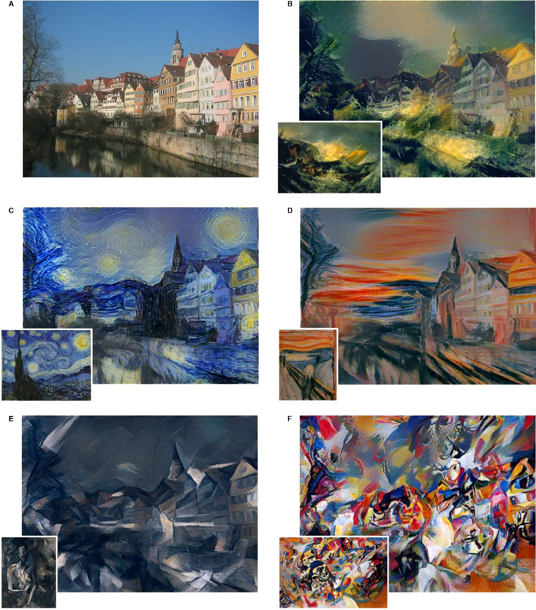
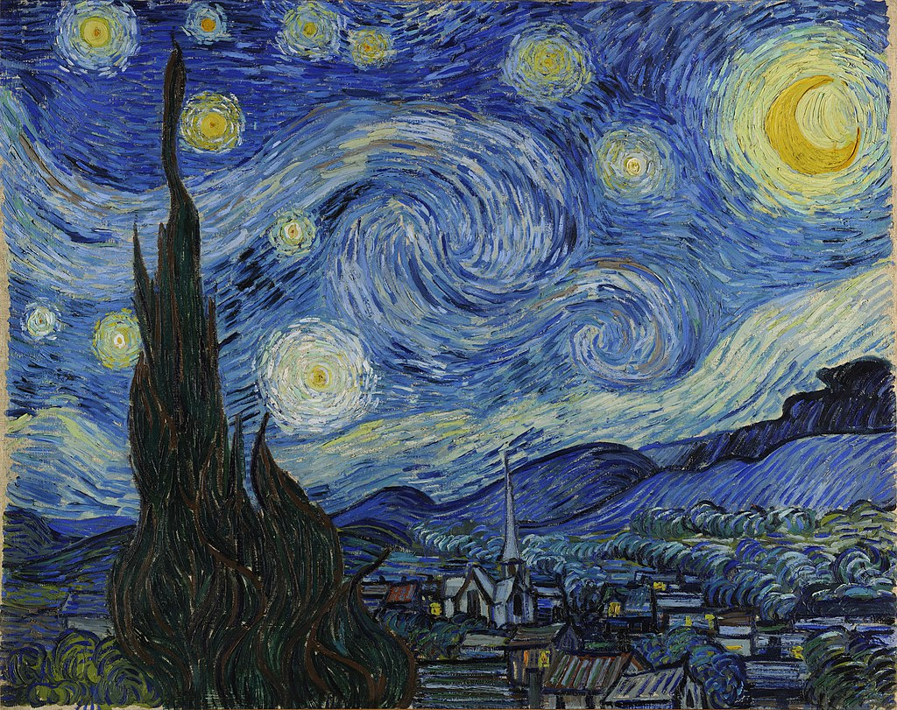
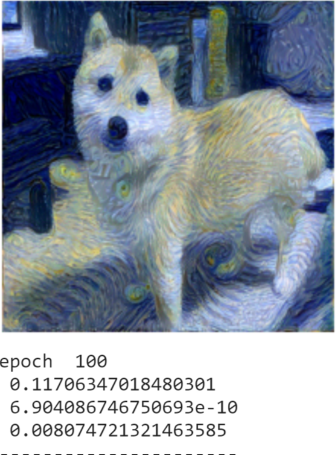
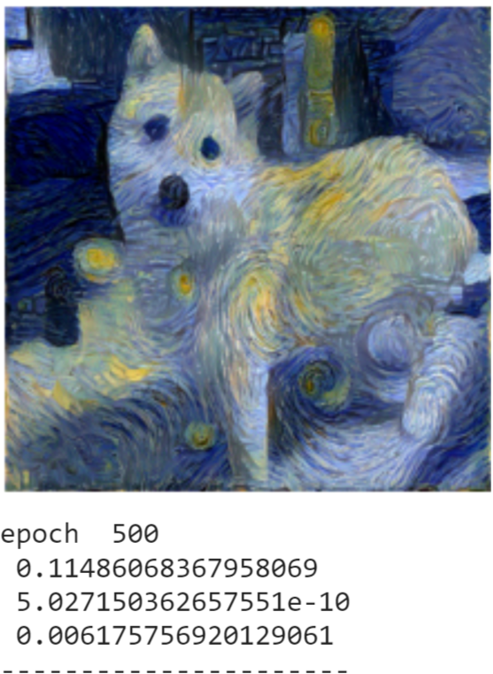
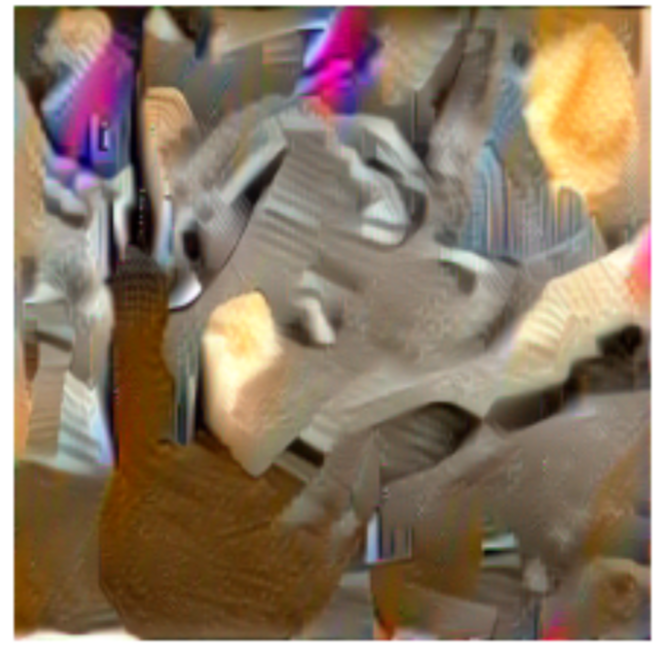

## **pytorch搭建风格迁移网络**
1. 图像风格迁移，就是将一幅图像的分割迁移到另一幅图像，让目标图像具有内容图像的内容又具有风格图像的风格。   

2. 原理：生成一副随机图片，不断丢入神经网络学习，直到设定的损失函数低于某个阈值或者达到我们训练的迭代次数。   
   **损失函数 = 风格损失 + 内容损失**（可以加上平滑损失，但是亲测如果目标图像是内容图的话不加上效果也依然   
   不减），具体原理网上有很多优秀解析文章就不详述，我的简易理解是利用卷积神经网络CNN不断下采样过程中，浅层   
   区域将会学习到比较局部的，抽象的特征。深层区域将学习到全局的，具体的特征这一特性。

3. 结果   
内容图   
   
风格图   
   
训练100次与500后的结果   
   
   
将风格图与内容图对调后的结果   

